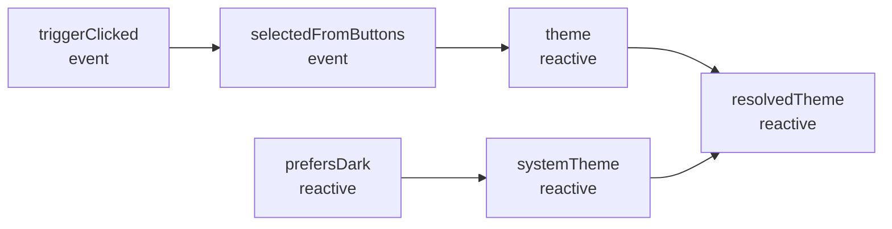

# FRP Graph Visualization Examples

This directory contains examples demonstrating the Synx FRP graph visualization system.

## Files

- **`graph-visualization.ts`** - Simple example showing graph tracking API
- **`graph-viewer.html`** - Interactive HTML viewer for visualizing graphs
- **`../dom/theme-dropdown-component/src/components/ThemeDropdown.graph.ts`** - Annotated ThemeDropdown component

## Quick Start

### 1. Run the Example

```bash
# From the project root
SYNX_GRAPH=1 tsx examples/frp/graph-visualization.ts
```

This will output:
- Console graph representation
- Mermaid diagram code
- Graphviz DOT format
- D3.js JSON data

### 2. Visualize in Browser

1. Run the example and copy the output
2. Open `graph-viewer.html` in your browser
3. Paste the output into the appropriate tab
4. Click "Render Graph"

### 3. Use in Your Component

```typescript
import { enableGraphTracking, printGraph, $ } from '@synx/frp/graph';
import * as E from '@synx/frp/event';
import * as R from '@synx/frp/reactive';

// Enable tracking
enableGraphTracking();

// Annotate your FRP nodes
const clicks = $('clicks', E.create<void>());
const count = $('count', E.fold(clicks, 0, (n) => n + 1));
const doubled = $('doubled', R.map(count, (n) => n * 2));

// Print the graph
printGraph();
```

## Example Output

### Console Output

```
=== FRP Graph ===
Nodes: 10
Edges: 12

Nodes:
  node_1: triggerClicked (event) [create]
  node_2: selectedFromButtons (event) [mergeAll]
    inputs: node_1
  node_3: theme (reactive) [stepper]
    inputs: node_2
  node_4: prefersDark (reactive) [create]
  node_5: systemTheme (reactive) [map]
    inputs: node_4
  node_6: resolvedTheme (reactive) [map]
    inputs: node_3, node_5

Edges:
  node_1 -> node_2 (subscription)
  node_2 -> node_3 (subscription)
  node_4 -> node_5 (subscription)
  node_3 -> node_6 (subscription)
  node_5 -> node_6 (subscription)
```

### Mermaid Diagram



## ThemeDropdown Component Example

The ThemeDropdown component visualized shows:

```
                ┌─────────────┐
                │prefersDark  │
                │  (reactive) │
                └──────┬──────┘
                       │
                       ▼
                ┌─────────────┐
                │ systemTheme │
                │  (reactive) │
                └──────┬──────┘
                       │
┌──────────────┐       │
│triggerClicked│       │
│   (event)    │       │
└──────┬───────┘       │
       │               │
       ▼               │
┌──────────────┐       │
│selectedFrom  │       │
│   Buttons    │       │
│   (event)    │       │
└──────┬───────┘       │
       │               │
       ▼               ▼
┌──────────────┐  ┌────────────┐
│    theme     │──│ resolved   │
│  (reactive)  │  │   Theme    │
└──────┬───────┘  │ (reactive) │
       │          └────────────┘
       │
       ▼
┌──────────────┐
│ triggerLabel │
│  (reactive)  │
└──────────────┘
```

## API Reference

See the [main documentation](../../packages/frp/GRAPH_VISUALIZATION.md) for complete API reference.

### Key Functions

```typescript
// Enable tracking
enableGraphTracking();

// Annotate nodes
const node = $('nodeName', E.create());

// Export graph
printGraph();                    // Console output
exportGraph('mermaid');          // Mermaid diagram
exportGraph('dot');              // Graphviz DOT
exportGraph('d3');               // D3.js JSON
exportGraph('json');             // Raw JSON
```

## Use Cases

### Debugging

Visualize complex FRP flows to understand data dependencies:

```typescript
enableGraphTracking();
const component = createMyComponent();
printGraph(); // See all connections
```

### Documentation

Generate diagrams for your documentation:

```typescript
const mermaid = exportGraph('mermaid');
// Add to your docs
```

### Testing

Validate component structure in tests:

```typescript
it('should have correct FRP structure', () => {
  enableGraphTracking();
  createComponent();
  const graph = getSerializedGraph();

  expect(graph.nodes).toHaveLength(10);
  expect(graph.edges).toHaveLength(12);
});
```

## Tips

1. **Annotate early** - Add `$()` calls as you write FRP code
2. **Use descriptive names** - Makes graphs easier to read
3. **Group related nodes** - Use consistent naming prefixes
4. **Enable conditionally** - Only in development/debug mode
5. **Export regularly** - Keep graph snapshots for comparison

## Troubleshooting

### "Graph is empty"

Make sure to:
- Call `enableGraphTracking()` BEFORE creating nodes
- Annotate with `$()`
- Check `SYNX_GRAPH=1` is set

### "Variable names missing"

You must manually annotate:

```typescript
// ❌ Won't capture name
const theme = E.stepper(...)

// ✅ Captures name
const theme = $('theme', E.stepper(...))
```

## Next Steps

- Read the [full documentation](../../packages/frp/GRAPH_VISUALIZATION.md)
- Try the [ThemeDropdown example](../dom/theme-dropdown-component/src/components/ThemeDropdown.graph.ts)
- Annotate your own components
- Share your visualizations!
